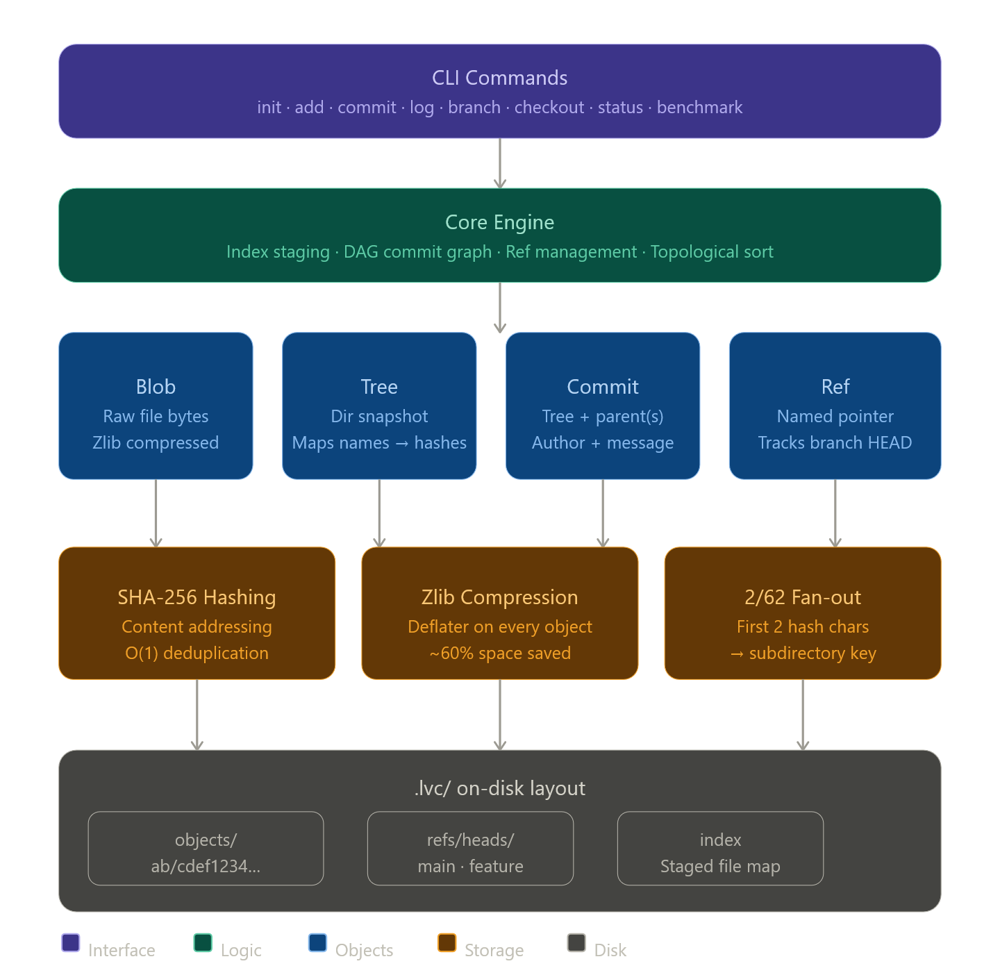

# 📦 LiteVC (Lite Version Control)


LiteVC is a lightweight, local, content-addressable version control system built from the ground up in Java. Engineered to mirror the core internal architecture of Git, it utilizes cryptographic hashing for robust data integrity and a **Directed Acyclic Graph (DAG)** to manage file history, snapshots, and branching efficiently.


---

## Key Features

* **Cryptographic Content Addressing:** Files and directories are identified and stored strictly by their `SHA-256` hash.
* **Recursive Snapshotting:** Utilizes hierarchical "Tree" objects to represent entire directory structures efficiently.
* **DAG-Based History:** Commits are nodes in a directed graph, pointing back to parent commits for non-linear history and easy branching.
* **Topological Log Rendering:** Includes a custom topological sort algorithm to accurately render the commit graph chronologically, even with multiple branches.
* **O(1) Deduplication:** Duplicated files across commits consume **zero** extra disk space, as identical content maps to the same hash.
* **Zlib Compression:** Every object (blob, tree, commit) is compressed with zlib (`Deflater`) before storage, significantly reducing the repository's footprint.

---

## System Architecture

LiteVC operates on a clean, 4-tier object model stored within the `.lvc/objects/` database:

1.  **Blobs:** Immutable, compressed byte-streams of your actual file contents.
2.  **Trees:** Hierarchical manifests that map filenames/directory names to Blob or other Tree hashes. A Tree represents a directory snapshot at a given point in time.
3.  **Commits:** Snapshots containing a Tree hash, parent Commit hash(es), author metadata, timestamp, and message.
4.  **Refs:** Named, mutable pointers (like `main`) that track the latest Commit in a branch, ultimately referencing the head of the DAG.

> **Design Note:** To maintain performance even with thousands of objects, LiteVC employs a `2/62` folder splitting mechanism, distributing objects across subdirectories based on the first two characters of their hash (e.g., `.lvc/objects/a1/b2c3d4...`).

---

## Performance Benchmarks

LiteVC includes an embedded testing suite (`StorageBenchmark.java`) to demonstrate algorithmic space-time efficiency. When benchmarked against its own Java source corpus:

| Metric | Raw Uncompressed | LiteVC Object Store | Efficiency Gain |
| :--- | :--- | :--- | :--- |
| **Standard Storage** | ~120.0 KB | ~48.0 KB | **~60.0% Space Saved** |
| **Deduplication (10x Copies)**| ~1.2 MB | ~48.0 KB | **>96.0% Space Saved** |

> **Note:** Run `lvc benchmark` (see below) to reproduce these results on your local machine.

---

## Installation & Setup

### Prerequisites

* Java Development Kit (JDK) 17 or higher.
* Gradle 7.x+ (Wrapper included for convenience).

### Get Started

1.  Clone the repository:
    ```bash
    git clone [https://github.com/kalyanSrinivas-G21/LiteVC.git](https://github.com/kalyanSrinivas-G21/LiteVC.git)
    cd LiteVC
    ```

2.  Build the project:
    ```bash
    ./gradlew build
    ```

---

## Usage & Workflows

Run LiteVC commands via the Gradle application wrapper, passing arguments with `--args=`:

| Command | Arguments | Description |
| :--- | :--- | :--- |
| `init` | None | Initializes a new, empty LiteVC repository in the current directory. |
| `add` | `<path>` | Hashes and stages files/directories to the Index. Use `.` for all files. |
| `status` | None | Compares the working directory against the Index to show modified/untracked files. |
| `commit` | `-m "<msg>"` | Packages the Index into a Tree and creates a new DAG Commit node. |
| `log` | None | Topologically sorts and visualizes the commit history graph. |
| `branch` | `<name>` | Creates a new branch pointer at the current HEAD. |
| `checkout` | `<hash/branch>`| Safely restores the working directory to match the target commit or branch. |
| `benchmark` | None | Runs the integrated storage and deduplication benchmark. |

### Example Workflow

```bash
./gradlew run --args="init"
./gradlew run --args="add ."
./gradlew run --args="commit -m 'Initial project structure and core architecture'"
./gradlew run --args="log"